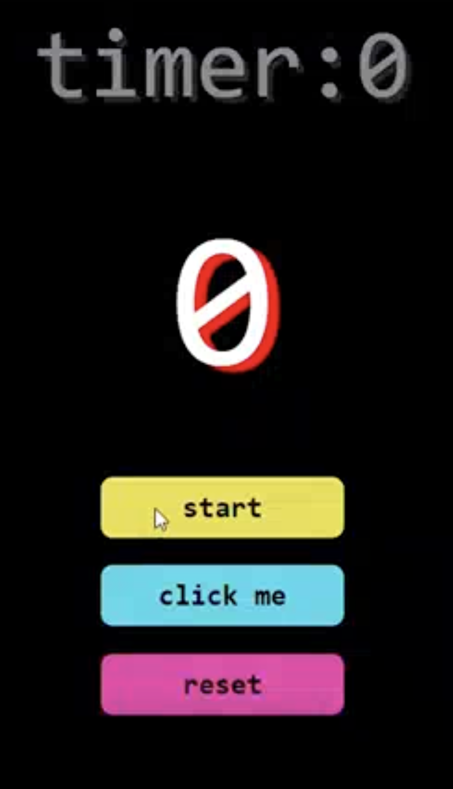
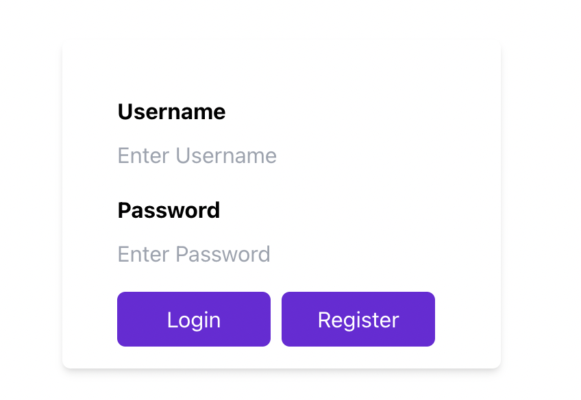
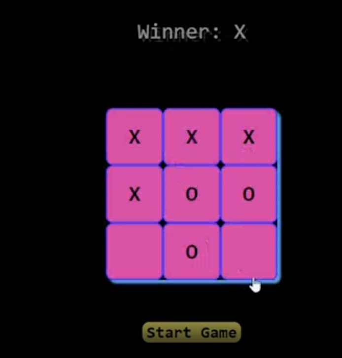
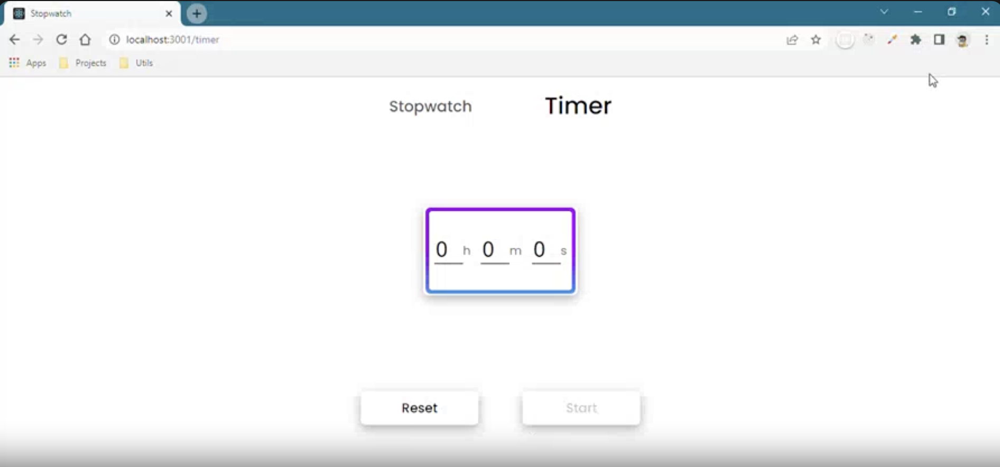

# React-Practice-Exercises

- This repository will contain the practice projects to practice react application building.
- Will be using tailwind CSS for the UI.

- Project 1 - Click Counter
  

- Project 2 - Custom form
  

- Project 3 - Tic Tac Toe
  

- Project 4 - Stopwatch
  
